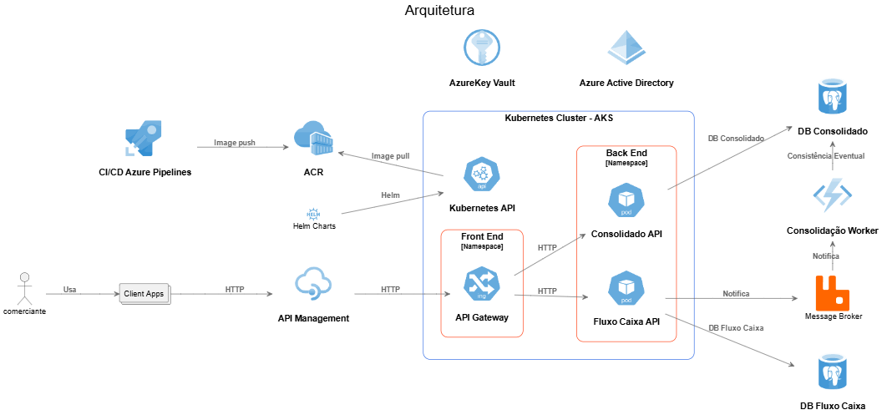

# Descrição:

Este repositório é referente a um desafio para Arquiteto de software.

- As aplicações foram desenvolvidas em .NET9 usando como base o Clear Architecture
- O banco usado foi PostgreSQL
- Para a demostração foi implementado com RabbitMQ

## fluxo-caixa-api
API para o cadastro de lançamentos de entra e saida

## consolidado-api
API para geração de relatório de consolidação de saldo

## consolidado-worker
Worker referente atualização dodos dados no bando de leitura

## Desenho da solução



# Instruções
## Execução das aplicações 
```sh
docker compose up -d --build 
```

## Realização das chamada HTTP
Diponibilizado o arquivo `requests.http` onde contem exemplas das chamada e pode ser executado pelo VSCode atravém da extenção [REST Client](https://marketplace.visualstudio.com/items?itemName=humao.rest-client)

com alternativa pode ser realizado pelo swagger de cada aplicação 
- [fluxo-caixa-api](http://localhost:7550/swagger/index.html)
- [consolidado-api](http://localhost:7551/swagger/index.html)


## Ferramentas Utilizadas
 - SwaggerUI
 - FluentValidation
 - QuestPDF
 - EntityFrameworkCore
 - Npgsql
 - Azure Functions
 - xUnit
 - Bogus
 - FluentAssertions
 - Moq

## Melhorias possíveis 
- Implementação do CQRS e a substituiçao do RabbitMQ pelo Apache Kafka  